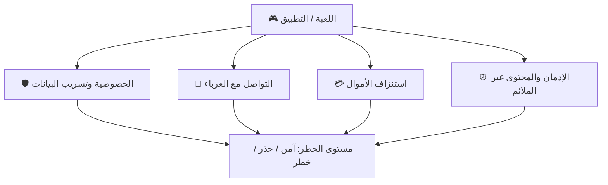
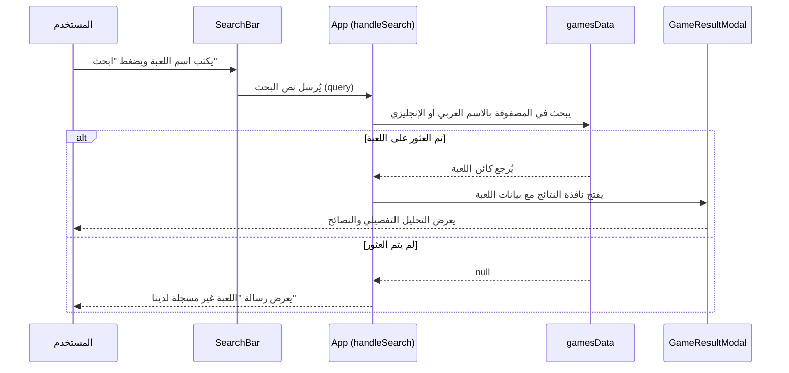

<![CDATA[# 📘 توثيق مشروع صمام الأمان — SafeGaming

> **الإصدار:** 1.0.0  
> **تاريخ التوثيق:** 17 مايو 2026  
> **حالة المشروع:** مكتمل وجاهز للإنتاج

---

## 📌 فكرة المشروع

**صمام الأمان (SafeGaming)** هي منصة ويب مستقلة وموثوقة باللغة العربية، مصمّمة خصيصًا لمساعدة **الآباء والأمهات العرب** على فهم مخاطر الألعاب الإلكترونية والتطبيقات الرقمية التي يستخدمها أطفالهم، واتخاذ قرارات مستنيرة بشأنها.

### 🎯 الأهداف الرئيسية

| # | الهدف | الوصف |
|---|-------|-------|
| 1 | **التوعية** | تثقيف الأهل حول المخاطر الرقمية الأربعة الأساسية |
| 2 | **التقييم** | تقديم تقييم أمان شامل لكل لعبة/تطبيق من 4 محاور |
| 3 | **الإرشاد** | توفير نصائح عملية وقابلة للتطبيق لكل محور خطر |
| 4 | **سهولة الوصول** | واجهة عربية بالكامل (RTL) مجانية ومتاحة 24/7 |

### 👥 الفئة المستهدفة

- الآباء والأمهات العرب
- المعلمون والمرشدون التربويون
- أي شخص مهتم بحماية الأطفال رقميًا

---

## 🔍 محاور التقييم الأربعة

كل لعبة أو تطبيق يتم تحليله من خلال **أربعة محاور أساسية**:



| المحور | الوصف |
|--------|-------|
| 🛡️ **الخصوصية** | هل تجمع اللعبة بيانات حساسة؟ هل تم تسجيل حوادث تسريب؟ |
| 👥 **الغرباء** | هل يمكن للغرباء التواصل مع الطفل؟ هل هناك مخاطر استدراج؟ |
| 💳 **الأموال** | هل تحتوي على مشتريات عدوانية أو صناديق عشوائية؟ |
| ⏰ **الإدمان** | هل التصميم إدماني؟ هل المحتوى ملائم للأطفال؟ |

### مستويات التقييم

كل محور يُقيَّم بأحد ثلاثة مستويات:

| المستوى | اللون | المعنى |
|---------|-------|--------|
| 🟢 `safe` | أخضر | آمن — لا توجد مخاطر كبيرة |
| 🟡 `caution` | أصفر | تحتاج حذر — مخاطر متوسطة يمكن التحكم بها |
| 🔴 `danger` | أحمر | خطر — مخاطر عالية تتطلب تدخلاً |

---

## ⚙️ التقنيات المستخدمة

### تقنيات أساسية (Core Stack)

| التقنية | الإصدار | الاستخدام |
|---------|---------|-----------|
| **React** | 19.2.6 | بناء واجهة المستخدم (UI Framework) |
| **Vite** | 8.0.12 | أداة البناء والتطوير (Build Tool) |
| **TailwindCSS** | 4.3.0 | تنسيق الواجهة (Utility-First CSS) |
| **Framer Motion** | 12.38.0 | الرسوم المتحركة والانتقالات (Animations) |
| **Lucide React** | 1.16.0 | مكتبة الأيقونات (Icon Library) |

### تقنيات التطوير (Dev Dependencies)

| التقنية | الاستخدام |
|---------|-----------|
| **ESLint** | فحص جودة الكود |
| **@vitejs/plugin-react** | دعم React في Vite |
| **@tailwindcss/vite** | تكامل Tailwind مع Vite |

### تقنيات التصميم

| العنصر | التفاصيل |
|--------|----------|
| **الخط** | Tajawal (Google Fonts) — خط عربي عصري |
| **اتجاه الواجهة** | RTL (من اليمين لليسار) |
| **نظام الألوان** | Dark Mode مع تدرجات Navy مخصصة |
| **التأثيرات** | Glassmorphism, Gradient Text, Glow Effects |

---

## 🏗️ هيكل المشروع

```
SafeGames/
├── index.html                 # نقطة الدخول الرئيسية (HTML)
├── package.json               # إعدادات المشروع والتبعيات
├── vite.config.js             # إعدادات Vite
├── eslint.config.js           # إعدادات ESLint
├── public/
│   ├── favicon.svg            # أيقونة الموقع
│   └── icons.svg              # أيقونات SVG إضافية
└── src/
    ├── main.jsx               # نقطة الدخول لـ React
    ├── App.jsx                # المكوّن الرئيسي (الصفحة الكاملة)
    ├── index.css              # الأنماط العامة ونظام التصميم
    ├── assets/
    │   └── hero.png           # صورة القسم الرئيسي
    ├── components/
    │   ├── Header.jsx         # شريط التنقل العلوي مع زر إعدادات AI
    │   ├── SearchBar.jsx      # حقل البحث التفاعلي بحالة التحميل
    │   ├── RiskCard.jsx       # بطاقة عرض المخاطر
    │   ├── GameResultModal.jsx # نافذة نتائج تحليل اللعبة مع شارة AI
    │   ├── ApiKeyModal.jsx    # نافذة ضبط وتجربة مفتاح Gemini API
    │   └── Footer.jsx         # التذييل
    ├── services/
    │   └── aiGameService.js   # خدمة الذكاء الاصطناعي (Gemini API & Fallback & Cache)
    └── data/
        └── gamesData.js       # قاعدة بيانات الألعاب المحلية والمقترحة
```

---

## 🧩 شرح المكوّنات (Components)

### 1. `App.jsx` — المكوّن الرئيسي

المكوّن الجذري الذي يجمع كل أقسام الصفحة:

- **Hero Section**: القسم الرئيسي مع عنوان جذاب وحقل بحث
- **About Section**: قسم "من نحن" مع إحصائيات المنصة
- **Risks Section**: عرض محاور التقييم الأربعة كبطاقات
- **Search Section**: قسم بحث ثانٍ مع شبكة لجميع الألعاب المُحلّلة
- **Footer**: تذييل الصفحة

**إدارة الحالة (State):**
```
selectedGame  → اللعبة المختارة حاليًا (null أو كائن لعبة)
notFound      → هل لم يتم العثور على اللعبة (true/false)
```

### 2. `Header.jsx` — شريط التنقل

- شريط ثابت أعلى الصفحة (`fixed`)
- يتغير مظهره عند التمرير (شفاف → شبه معتم مع ضبابية)
- قائمة تنقل للشاشات الكبيرة + قائمة هامبرغر للموبايل
- شعار المنصة مع تأثيرات hover

### 3. `SearchBar.jsx` — حقل البحث

- نموذج بحث مع تأثير توهج عند التركيز (Glow Effect)
- يدعم حجمين: `large` (للأقسام الرئيسية) و`small`
- يبحث بالاسم الإنجليزي أو العربي للعبة
- تصميم LTR للحقل مع نص RTL بداخله

### 4. `RiskCard.jsx` — بطاقات المخاطر

- أربع بطاقات تمثل محاور التقييم
- كل بطاقة بلون مميز (أزرق، أحمر، أصفر، بنفسجي)
- تأثيرات حركية عند الظهور في viewport
- أيقونات SVG مخصصة لكل محور

### 5. `GameResultModal.jsx` — نافذة نتائج التحليل

- نافذة منبثقة (Modal) تعرض تحليل اللعبة الكامل
- تعرض: اسم اللعبة، التصنيف العمري، التقييم العام
- تحليل تفصيلي لكل محور من المحاور الأربعة
- نصائح عملية للأبوين في كل محور
- شارات ملونة لمستوى الخطر (آمن/حذر/خطر)
- قابلة للتمرير مع قفل تمرير الخلفية

### 6. `Footer.jsx` — التذييل

- ثلاثة أعمدة: العلامة التجارية، روابط سريعة، التواصل
- شريط حقوق الملكية السفلي
- تصميم متجاوب (عمود واحد على الموبايل)

---

## 🗄️ قاعدة بيانات الألعاب

الملف `gamesData.js` يحتوي على **26 لعبة وتطبيق** مُحلّلة، تشمل:

### الألعاب والتطبيقات المُحلّلة

| # | الاسم | التصنيف العمري | التقييم العام |
|---|-------|---------------|--------------|
| 1 | Roblox | +7 | 🔴 خطر |
| 2 | PUBG Mobile | +16 | 🔴 خطر |
| 3 | Minecraft | +7 | 🟢 آمن |
| 4 | Fortnite | +12 | 🟡 حذر |
| 5 | Among Us | +9 | 🟢 آمن |
| 6 | TikTok | +13 | 🔴 خطر |
| 7 | Brawl Stars | +9 | 🟡 حذر |
| 8 | Clash Royale | +9 | 🟡 حذر |
| 9 | Genshin Impact | +12 | 🟡 حذر |
| 10 | FIFA Mobile | +3 | 🟡 حذر |
| 11 | Call of Duty Mobile | +17 | 🔴 خطر |
| 12 | Clash of Clans | +9 | 🟡 حذر |
| 13 | YouTube Kids | +3 | 🟢 آمن |
| 14 | Candy Crush | +3 | 🟢 آمن |
| 15 | GTA V Online | +18 | 🔴 خطر |
| 16 | Stumble Guys | +3 | 🟢 آمن |
| 17 | Snapchat | +13 | 🔴 خطر |
| 18 | Valorant | +16 | 🟡 حذر |
| 19 | Subway Surfers | +3 | 🟢 آمن |
| 20 | League of Legends | +12 | 🟡 حذر |
| 21 | Instagram | +13 | 🔴 خطر |
| 22 | Rocket League | +3 | 🟢 آمن |
| 23 | Free Fire | +12 | 🔴 خطر |
| 24 | Monopoly GO | +3 | 🟡 حذر |
| 25 | WhatsApp | +13 | 🟡 حذر |
| 26 | Apex Legends | +16 | 🟡 حذر |

### هيكل بيانات كل لعبة

```javascript
{
  id: 1,                          // معرّف فريد
  name: "Roblox",                 // الاسم بالإنجليزية
  nameAr: "روبلوكس",              // الاسم بالعربية
  icon: "🎮",                     // أيقونة إيموجي
  ageRating: "+7",                // التصنيف العمري
  overallSafety: "danger",        // التقييم العام (safe/caution/danger)
  description: "وصف اللعبة...",    // وصف مختصر بالعربية
  risks: {
    privacy:   { level, title, details, tips[] },  // تحليل الخصوصية
    strangers: { level, title, details, tips[] },  // تحليل التواصل
    money:     { level, title, details, tips[] },  // تحليل الأموال
    addiction: { level, title, details, tips[] }   // تحليل الإدمان
  }
}
```

---

## 🔄 آلية عمل المشروع

### سير عمل البحث



### آلية البحث بالتفصيل

```javascript
// 1. تحويل نص البحث لأحرف صغيرة
const q = query.toLowerCase();

// 2. البحث في مصفوفة الألعاب
const found = gamesData.find(
  (g) => g.name.toLowerCase().includes(q)  // بحث بالإنجليزية
      || g.nameAr.includes(query)           // أو بحث بالعربية
);

// 3. عرض النتيجة أو رسالة عدم العثور
```

### طرق الوصول للنتائج

1. **البحث النصي**: كتابة اسم اللعبة في حقل البحث
2. **الاقتراحات السريعة**: أزرار اقتراح في قسم Hero
3. **شبكة الألعاب**: الضغط على أي لعبة في قسم Search

---

## 🎨 نظام التصميم

### لوحة الألوان (Color Palette)

| اللون | الكود | الاستخدام |
|-------|-------|-----------|
| Navy-950 | `#060f28` | خلفية الموقع الرئيسية |
| Navy-900 | `#0a1a3f` | خلفية البطاقات الزجاجية |
| Navy-600 | `#30509e` | شريط التمرير |
| Blue-500 | `#3a60a6` | اللون الرئيسي |
| Emerald | `#10b981` | اللون الآمن (Safe) |
| Amber | `#f59e0b` | لون التحذير (Caution) |
| Red | `#ef4444` | لون الخطر (Danger) |

### الأنماط المخصصة

| النمط | الوصف |
|-------|-------|
| `.glass-card` | بطاقات بتأثير الزجاج المعتم (Glassmorphism) |
| `.gradient-text` | نص بتدرج لوني أزرق-أخضر |
| `.hero-gradient` | خلفية متدرجة شعاعية للقسم الرئيسي |
| `.search-glow` | تأثير توهج عند التركيز على البحث |
| `.section-container` | حاوية مركزية متجاوبة (max-width: 1280px) |
| `.animate-float` | حركة طفو مستمرة للعناصر الزخرفية |

### التجاوبية (Responsive Design)

| نقطة القطع | عرض الحاوية | الحشو الجانبي |
|-----------|-------------|---------------|
| < 640px | 100% | 32px |
| ≥ 640px | 100% | 48px |
| ≥ 1024px | max 1280px | 64px |

---

## 🚀 كيفية تشغيل المشروع

### المتطلبات الأساسية

| المتطلب | الحد الأدنى |
|---------|-----------|
| **Node.js** | الإصدار 18 أو أعلى |
| **npm** | الإصدار 9 أو أعلى |

### خطوات التشغيل المحلي

```bash
# 1. الانتقال لمجلد المشروع
cd d:\SafeGames

# 2. تثبيت التبعيات
npm install

# 3. تشغيل خادم التطوير
npm run dev
```

سيعمل الموقع على: `http://localhost:5173`

### بناء نسخة الإنتاج

```bash
# بناء المشروع للنشر
npm run build

# معاينة نسخة الإنتاج محليًا
npm run preview
```

ملفات الإنتاج تُنشأ في مجلد `dist/`

### الأوامر المتاحة

| الأمر | الوظيفة |
|-------|---------|
| `npm run dev` | تشغيل خادم التطوير مع Hot Reload |
| `npm run build` | بناء نسخة الإنتاج المُحسّنة |
| `npm run preview` | معاينة نسخة الإنتاج محليًا |
| `npm run lint` | فحص جودة الكود بـ ESLint |

---

## 📊 ملخص إحصائي

| العنصر | العدد |
|--------|------|
| إجمالي الألعاب/التطبيقات المُحلّلة | 26 |
| محاور التقييم لكل لعبة | 4 |
| إجمالي التقييمات الفردية | 104 |
| المكوّنات (Components) | 5 |
| إجمالي ملفات الكود المصدري | 8 |

### توزيع التقييمات العامة

| المستوى | العدد | النسبة |
|---------|------|--------|
| 🟢 آمن | 7 | 27% |
| 🟡 حذر | 11 | 42% |
| 🔴 خطر | 8 | 31% |

---

## 🔮 خطة التطوير المستقبلية

| الأولوية | الميزة | الوصف |
|---------|--------|-------|
| 🔴 عالية | إضافة ألعاب جديدة | توسيع قاعدة البيانات لتشمل المزيد من الألعاب |
| 🔴 عالية | Backend API | إنشاء خادم خلفي لإدارة البيانات ديناميكيًا |
| 🟡 متوسطة | نظام اقتراح الألعاب | السماح للمستخدمين بطلب تحليل لعبة جديدة |
| 🟡 متوسطة | المقارنة بين الألعاب | مقارنة مستوى أمان لعبتين جنبًا إلى جنب |
| 🟢 منخفضة | تقارير PDF | تصدير تقرير اللعبة كملف PDF للطباعة |
| 🟢 منخفضة | تطبيق موبايل | تحويل المنصة لتطبيق React Native |

---

> **صُنع بـ ❤️ لحماية أطفالنا في العالم الرقمي**
]]>
